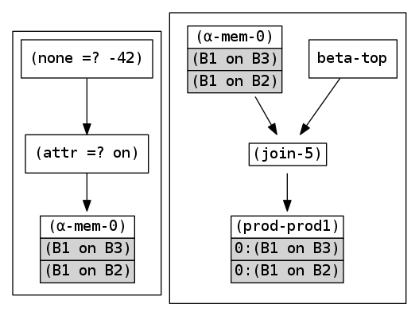
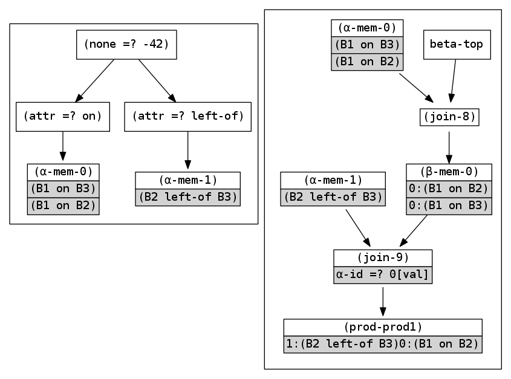
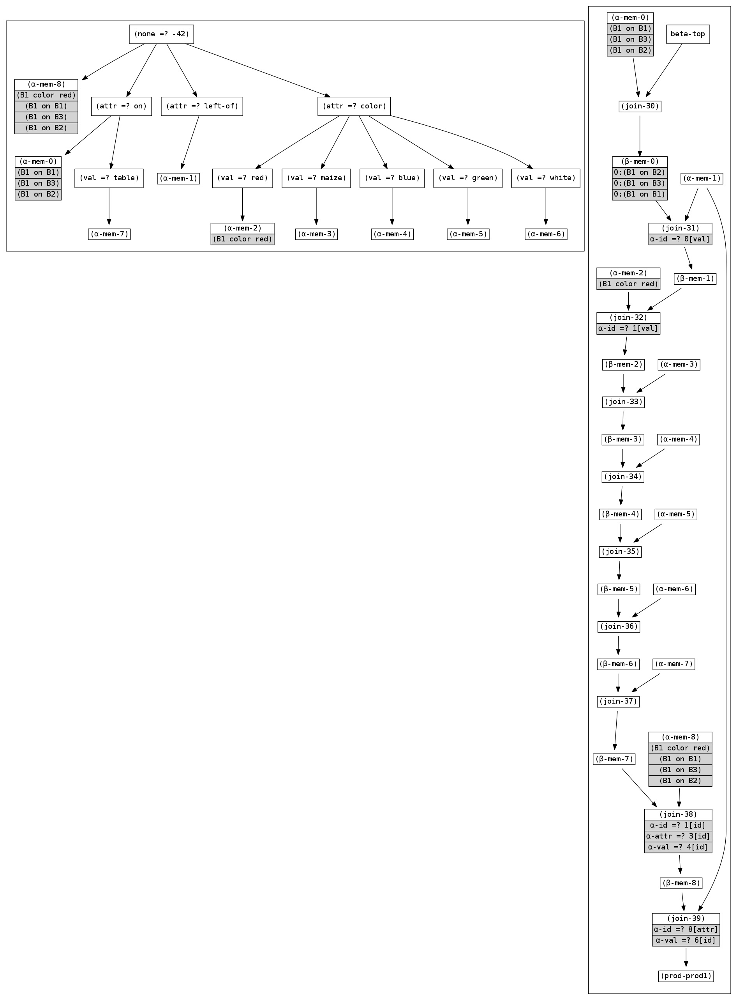

# RETE

This is a reference tutorial implementation of the rete pattern matching
algorithm, along with GraphViz code to visualize the algorithm as it executes.
The implementation is from
[Robert B. Doorenbos' PhD Thesis: Production Matching for Large Learning Systems](http://reports-archive.adm.cs.cmu.edu/anon/1995/CMU-CS-95-113.pdf).

- `rete0.cpp` is a *faithful* implementation from the thesis, to the extent
   that it has *page number* markings in the source code to refer to the
   thesis. It is recommended to read `rete0.cpp` when one is reading the
   thesis alongside it.

- `rete1.cpp` is a *re-implementation* of `rete0` with no added feature,
   which (in my opinion) irons out some of the quirks of the 
   `rete0` presentation. For one, we don't use a 
   common `ReteNode`. I found the `ReteNode` more confusing
   than enlightening. We also abandon the `left/right` convention, and simply
   speak of `alpha-side/beta-side`.

### Example Rete diagrams to learn from:

